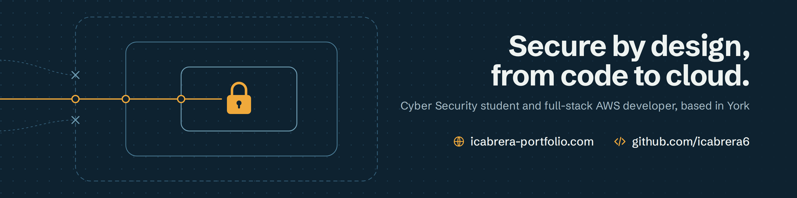

# Hi, I'm Isaac 👋

Cyber Security student at **York St John University** and full-stack developer, focused on building secure applications on AWS. Previously a software developer for a hospital, building tools that help clinical staff use generative AI safely.

## What I'm working on

- Studying for a BSc (Hons) in Cyber Security, with a long-term goal of becoming a cloud security architect.
- Check my repos!

## Tech I use

**Languages:** TypeScript, JavaScript, Java, SQL, Python
**Frontend:** React, Vite, PWAs
**Cloud:** AWS (Lambda, API Gateway, DynamoDB, S3, Cognito, CloudFront, Bedrock, VPC, IAM)
**Infrastructure as code:** AWS CDK, Terraform
**Practices:** test-driven development (Vitest), role-based access control, least privilege, Git

## Find me

Open to part-time roles and placements in software development, IT support and cloud.
